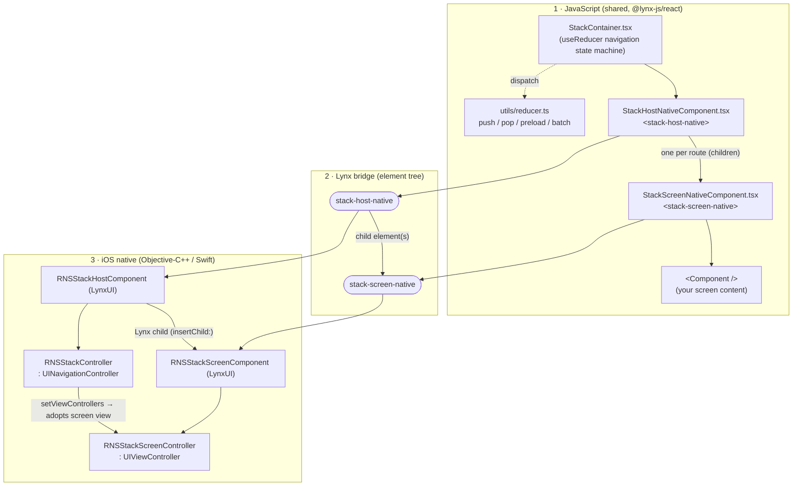
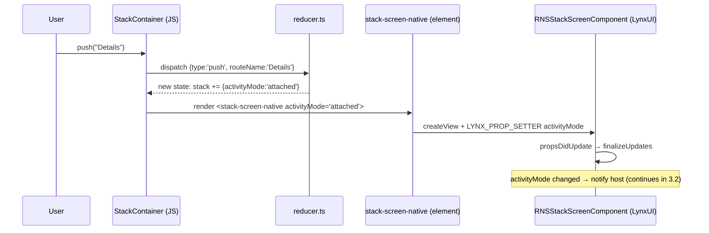
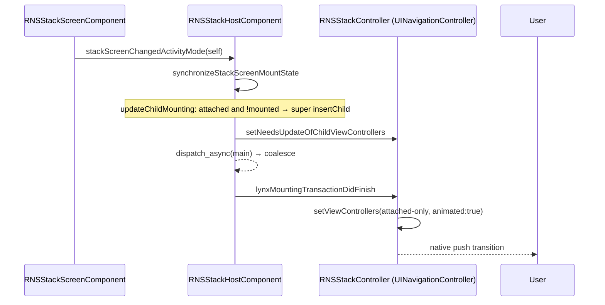
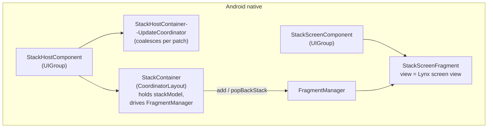

# Lynx Screens - Architecture

## 0. About `react-native-screens`

`react-native-screens` brings each platform's **native navigation primitives** to React Native.

Historically, a react navigation stack kept *every* screen mounted at once, as plain React-managed views. That approach was consuming lot of memory, and - more importantly - it means navigation itself (the screen transition animations, the swipe-back gesture, the header/nav bar) had to be implemented in JS, instead of providing a "truly native feeling" of platform-specific navigation.

`react-native-screens` replaces that with mounting screens inside **native containers**, so the OS can drive the transitions and gestures, apply native look-and-feel, and free the resources of screens that are not currently visible.

| Platform | Native primitive it exposes |
|---|---|
| iOS | `UINavigationController` + `UIViewController` |
| Android | `FragmentManager` + `Fragment` |

The **"native stack"** (the *v5* architecture referenced throughout this document) is the navigator built *directly* on top of these primitives: **JS only declares which screens exist and which are currently on the stack**, and the platform performs the actual navigation.

`lynx-screens` is a port of that same native-stack v5 model to **Lynx**. Our goal is to keep the contract and the mental model identical. The only thing that changes is the host framework: **Lynx Custom Native Elements** instead of React Native's components. In a later stage of development, the plan is to **extract the `screens-core` target and expose interfaces that various frameworks could implement**. The rest of this document describes how that port is wired on iOS (Sections 1-7); Section 8 summarizes how the Android side compares.

---

## 1. The mental model

`lynx-screens` reproduces the `react-native-screens` "native stack v5" architecture on Lynx. The idea is the same that JS only declares *which screens exist and whether each one is currently on the stack*; the platform's real navigation primitive (`UINavigationController` on iOS) performs the push/pop, the gestures, and the transitions.

The contract is based on two Custom Native Elements

| Layer | iOS primitive equivalent | Responsibility |
|---|---|---|
| **`stack-host-native`** | `UINavigationController` | One per stack. The actual navigator. |
| **`stack-screen-native`** | `UIViewController` | One per screen. Its `.view` **is** the Lynx screen view. |

The single source of truth crossing the bridge is the **`activityMode`** prop on each screen - `"attached"` or `"detached"`. Everything the native side does (push, pop, preload, dismiss) is derived from that state and the native lifecycle of the element.

```
activityMode semantics
  detached at creation .............. screen is PRELOADED (already built, not shown)
  attached .......................... screen is PUSHED
  detached after being attached ..... screen is POPPED
```

---

## 2. The component graph



* **Component** (`LynxUI` subclass) - the Lynx-facing object. Receives props, owns the view, is the integration surface for Lynx.
* **View** (`UIView` subclass).
* **Controller** (`UINavigationController` / `UIViewController`) - the UIKit navigation primitives.

---

## 3. The end-to-end flow of a `push` operation

### 3.1 JS prop update to native attribute update



Up to here everything is operating mainly inside Lynx framework: a JS render triggers a prop update, and the Custom Element processed it. No component was attached to the native hierarchy and moved to the screen yet.

### 3.2 Native reconciliation



The reverse (a `pop`) is symmetric: JS flips `activityMode` to `"detached"`, the same `synchronize - coalesce - setViewControllers` path runs, and because the detached screen is filtered out of the controller list, `UINavigationController` performs a pop.

---

## 4. The API shape

This is the surface a consumer actually sees.

### 4.1 Elements

Two custom elements, registered under these tag names:

| Element | Native implementation | JS wrapper |
|---|---|---|
| `stack-host-native` | `RNSStackHostComponent` | `StackHostNativeComponent` |
| `stack-screen-native` | `RNSStackScreenComponent` | `StackScreenNativeComponent` |

### 4.2 `stack-host-native` props reference

No props so far. It is a pure container for managing the lifecycle of `StackScreens`.

### 4.3 `stack-screen-native` props reference

| Prop | Type  | Purpose |
|---|---|---|
| `activityMode` | `"attached" \| "detached"` | Driving the screen state |
| `screenKey` | `string` |  Stable identity of screen for routing. |
| `preventNativeDismiss` | `boolean` | Android-only |

### 4.4 The JS imperative API

Having `StackNavigationContext` populated in `StackContainer`:

| Method | Reducer action | Effect |
|---|---|---|
| `push(routeName)` | `push` | Attach an existing detached instance, or create a new attached one. |
| `pop(routeKey)` | `pop` | Flip to detached (or emit `pop-container` if it's the last screen of nested stack). |
| `preload(routeName)` | `preload` | Append a detached instance at the end of the stack. |
| `batch([...])` | `batch` | Fold several actions into single reducer pass and one native transition. |

---

## 5. The JS navigator

### 5.1 Rendering

`StackContainer` renders one `stack-host-native` wrapping `stack.map(...)` of `stack-screen-native` elements. Each screen is keyed by `routeKey`, receives its `activityMode`, and provides a fresh `StackNavigationContext` to its subtree so nested containers and screen content can navigate.

### 5.2 Nested stacks & the `pop-container` effect

A screen may itself render another `StackContainer`. When a nested stack is asked to pop its **last** remaining screen, it cannot pop itself out of existence - so the reducer emits a `pop-container` effect. `useParentNavigationEffect` consumes that effect and calls the **parent** container's `pop(parentRouteKey)`, which pops the whole nested stack as a single screen in the parent.

---

## 6. Host reconciliation - from `activityMode` to `setViewControllers`

### 6.1 Attaching the navigator into the host app's VC hierarchy

A `UINavigationController` must live inside the app's view-controller hierarchy to behave correctly (nav bar etc.). But Lynx hands components a `UIView`, not a parent `UIViewController`. So the host finds its parent VC itself:

1. `RNSStackHostView.didMoveToWindow` fires once the view is on-screen
2. `lynxAddControllerToClosestParent:` walks **up the superview chain** to find the nearest `UIViewController`.

### 6.2 Inserting Screens as Host children

Lynx would normally register every inserted child. We override that so that **detached (preloaded) screens are excluded from the Lynx child list** until they become attached:

* `insertChild:atIndex:` - does **not** call base method from `LynxUI`. It rather calls
  `synchronizeStackScreenMountState:`.
* `updateChildMountingForStackScreen:` - the *only* place a screen is actually registered as a Lynx child, only when `activityMode == attached` and in NOT already mounted. The child is always appended to the end of the list.
* `removeChild:atIndex:` - **remaps the index manually**: it ignores the index Lynx passes and instead looks up the screen's real position in `children` array before calling the base method.

`children` of StackHost holds *only attached* screens. This is the mechanism that makes **screen preloading** possible.

### 6.3 Coalescing prop updates into one transition

When several screens change `activityMode` in one JS render (e.g. a `batch` operation), we want **a single** `setViewControllers` call, not one per screen.

```objc
[_controller setNeedsUpdateOfChildViewControllers];   // mark dirty
[self updateChildMountingForStackScreen:stackScreen];  // maybe register as child
if (!_isMountingTransactionPending) {
    _isMountingTransactionPending = YES;
    dispatch_async(dispatch_get_main_queue(), ^{       // defer to end of runloop turn
        self->_isMountingTransactionPending = NO;
        [self lynxMountingTransactionDidFinish];
    });
}
```

The `dispatch_async` fires once per runloop turn, so any number of `activityMode` flips in the same turn collapse into a single `lynxMountingTransactionDidFinish`.Note: "one runloop turn" is a *proxy* for "one Lynx patch." Verification against Lynx 3.9 found a potentially better, supported signal - `onNodeReady` on the host component fires once per patch it participates in - so this `dispatch_async` should be replaced.

### 6.4 The actual push/pop: `setViewControllers`

`RNSStackController.updateChildViewControllers()` is where navigation happens:

```swift
let activeControllers = sourceAllViewControllers()
    .filter { $0.screen.activityMode == .attached }
setViewControllers(activeControllers, animated: true)
```

`sourceAllViewControllers()` maps `stackHostComponent.children` to each screen's `RNSStackScreenController`. The `.filter { activityMode == .attached }` is what turns a detached flag into a **native pop operation**, so `UINavigationController` animates it away. A newly attached screen appears in the list and is pushed.

---

## 7. Native props update model

### 7.1 Prop batching on the screen

Prop setters only set flags; the work happens once per update batch in `propsDidUpdate`

```objc
LYNX_PROP_SETTER("activityMode", …) { … if (changed) _hasUpdatedActivityMode = YES; }

- (void)propsDidUpdate { [self finalizeUpdates]; }

- (void)finalizeUpdates {
    if (_hasUpdatedActivityMode) { _hasUpdatedActivityMode = NO;
        [self.stackHost stackScreenChangedActivityMode:self]; } // notify host once
}
```

### 7.2 Native-dismiss vs JS-dismiss

When a screen's `UIViewController` is removed from its parent, we must tell JS the origin **who caused it**, because the two cases update JS state differently (`pop-native` vs `pop-completed`).

```swift
public override func didMove(toParent parent: UIViewController?) {
    super.didMove(toParent: parent)
    if parent == nil {
        if self.screen.activityMode == .detached {
            screen.emitOnDismiss()        // isNativeDismiss = NO
        } else {
            screen.emitOnNativeDismiss()  // isNativeDismiss = YES
        }
    }
}
```

The discriminator is **timing**:

* **JS-initiated pop** - JS flips `activityMode` to `detached` *first*; the resulting `setViewControllers` removes the VC *because* it's already detached. By the time `didMove(toParent:nil)` fires, `activityMode == .detached`. The result is `onDismiss({native: false})` event emission followed by `popCompletedAction` (remove from state).
* **User gesture / back button** - UIKit removes the VC while JS still believes the screen is `attached`. `activityMode == .attached`. The result is `onDismiss({native: true})`, calling `onNativeDismiss` followed by `popNativeAction` (remove from state).

And `StackContainer` maps those reducer actions.

---

## 8. Comparison with Android architecture

The Android implementation follows the **exact same contract** as iOS: the whole shared JS layer (Sections 2-5), the two custom elements, and the `activityMode` state machine are unchanged. Only the native part is rewritten, because Android's navigation primitive is different. There is no single "navigator" object like `UINavigationController`; the platform primitive is the **`FragmentManager`**, with each screen wrapped in a **`Fragment`**.

### 8.1 Primitive mapping

| Layer | iOS | Android |
|---|---|---|
| The navigator | one `UINavigationController` instance | a `FragmentManager` + its back stack |
| A screen container | a `UIViewController` | a `Fragment` |



### 8.2 What is the same as iOS

* **Same elements definition and API contract.** Everything in Sections 2-5 is shared and untouched.
* **Preloading works the same way.** Detached screens are kept *out of the native navigator*: `StackHostComponent.insertChild` only registers a screen as a real Lynx child (and later gets a `Fragment`) once `activityMode == ATTACHED`.
* **Many `activityMode` flips coalesce into one native transition** - the equivalent of `dispatch_async` coalescing implemented on iOS.
* **JS-pop vs native-pop is discriminated by timing.** - the value of `activityMode` at the moment the screen container is destroyed tells us who initiated the dismissal, and drives `onDismiss({native: ...})`.
* **The host finds its container by walking up the native tree.** iOS walks the superview chain to the nearest `UIViewController`; Android walks the view-parent chain to the nearest `FragmentProviding` to resolve the right `FragmentManager`.

### 8.3 What is different

1. **No single navigator object - FragmentManager transactions, not a declarative array.** iOS hands UIKit the *desired end state* (via `setViewControllers`). Android has no such call - you must **compute and commit the individual push/pop transactions yourself**. That is why on Android we need to care about the state updating model ourselves with `FragmentOperationExecutor` command objects (`AddAndSetAsPrimaryOp`, `PopBackStackOp`, etc.).

2. **Coalescing uses the *proper* Lynx signal.** iOS uses `dispatch_async(main)` for "single Lynx patch" detection. On Android, `StackHostComponent` implements `PatchFinishListener`, and `onPatchFinish()` to perform operations **once per Lynx patch**. The flow is two-stage: `StackHostContainerUpdateCoordinator` gathers all push/pop operations from `activityMode` changes during the patch, then `onPatchFinish` flushes them into the native `StackContainer` in a single batch.

3. **A screen is a `Fragment`; its lifecycle drives the appearance events.** `StackScreenFragment.onCreateView` returns the Lynx screen view directly, and the Fragment lifecycle is mapped to screen events by a `LifecycleEventObserver` (iOS wires the equivalents through `viewWill/DidAppear`).

4. **Transitions & layout are more hands-on.** `UINavigationController` provides screen transition animation for free. On Android the fragment sets its own `Slide` enter/exit transitions manually.

5. **`preventNativeDismiss` is supported only on Android.** `PreventNativeDismissCallback` registers on the Activity's `OnBackPressedDispatcher` and is enabled only while its fragment is the top one, intercepting the hardware / predictive **back gesture** - emitting `OnNativeDismissPrevented` event to JS instead of popping the Screen.
